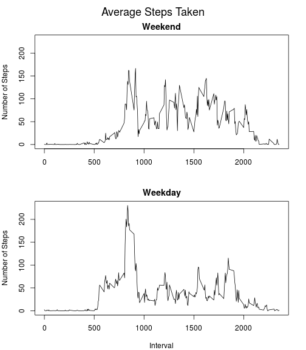

Reproducible Research Project 1
-------------------------------

#Load Data

```r
dataFileName <- "./Data/activity.csv"
# Unzip data if needed
if (!file.exists(dataFileName)) {
    dataZipFile <- "./repdata_data_activity.zip"
    unzip(dataZipFile, exdir = "./Data")
}
activities <- read.csv(dataFileName, na.strings = "NA", stringsAsFactors = FALSE)
```
#Explore Data

```r
str(activities)
```

```
## 'data.frame':	17568 obs. of  3 variables:
##  $ steps   : int  NA NA NA NA NA NA NA NA NA NA ...
##  $ date    : chr  "2012-10-01" "2012-10-01" "2012-10-01" "2012-10-01" ...
##  $ interval: int  0 5 10 15 20 25 30 35 40 45 ...
```

```r
naCount <- sum(is.na(activities$steps))
daysRecorded <- length(table(activities$date))
summary(activities$steps)
```

```
##    Min. 1st Qu.  Median    Mean 3rd Qu.    Max.    NA's 
##    0.00    0.00    0.00   37.38   12.00  806.00    2304
```
The data contains 2304 Non-Available steps counts. The total number of 
days recorded was 61.

#What is mean total number of steps taken per day?

```r
dailySteps <- tapply(activities$steps, activities$date, sum, na.rm = TRUE)
hist(dailySteps, main = "Histogram of Steps per Day", xlab = "Steps per Day")
rug(dailySteps)
```


```r
dayMean <- mean(dailySteps)
dayMedian <- median(dailySteps)
```
The mean steps per day is 9354.23 and the median 
steps per day is 10395.

#What is the average daily activity pattern?

```r
intervalAverageSteps <- tapply(activities$steps, activities$interval, mean, 
                               na.rm = TRUE)
plot(names(intervalAverageSteps), intervalAverageSteps, type = "l", 
     main = "Average Steps Taken", xlab = "5-minute Interval", ylab = "Steps")
```


```r
maxAverageInterval <- names(intervalAverageSteps)[which.max(intervalAverageSteps)]
```
Inteval 835 has the maximum average of steps accross all days.

#Missing Values Analysis

```r
rowsWithNAs <- sum(!complete.cases(activities))
percentNASteps <- round(mean(is.na(activities$steps)) * 100, 3)
```
The total number of rows with NAs is 2304. The percent of steps counts 
non-available is 13.115.  

####We are going to use the mean for each 5-minute interval to impute non-available steps counts:

```r
updatedData <- activities
updatedData$steps <- apply(activities, 1, function(x){
                                    ifelse(is.na(x["steps"]),
                                           intervalAverageSteps[trimws(x["interval"])],
                                           as.numeric(x["steps"]))})
newRowsWithNAs <- sum(!complete.cases(updatedData))
```
There is 0 rows with NAs in updated data.
  
##Make a histogram of the total number of steps taken each day and Calculate and report the mean and median total number of steps taken per day.

```r
updatedDailySteps <- tapply(updatedData$steps, updatedData$date, sum)
hist(updatedDailySteps, main = "Histogram of Steps per Day", xlab = "Steps per Day")
rug(updatedDailySteps)
```


<h3>Do these values differ from the estimates from the first part of the 
assignment? What is the impact of imputing missing data on the estimates of the 
total daily number of steps?</h3>

```r
newDayMean <- mean(updatedDailySteps)
newDayMedian <- median(updatedDailySteps)
newDayMeanIncrease <- newDayMean - dayMean
newDdayMedianIncrease <- newDayMedian - dayMedian
```
The new mean is 10766.19 and increased by 
1411.96. The new median is 
10766.19 and increased by 
371.19. After imputing the 
non-available values, the data looks less skewed to the left and more normal.

#Are there differences in activity patterns between weekdays and weekends?

```r
weekdaysNames <- c('Monday', 'Tuesday', 'Wednesday', 'Thursday', 'Friday')
updatedData$WeekDay <- weekdays(as.Date(updatedData$date, format = "%Y-%m-%d")) %in% weekdaysNames
updatedData$WeekDay <- factor(updatedData$WeekDay, labels = c("weekend", 
                                                              "weekday"))

weekdaysData <- updatedData[which(updatedData$WeekDay == "weekday"),]
weekendData <- updatedData[which(updatedData$WeekDay == "weekend"),]

weekdaysIntervalAverageSteps <- tapply(weekdaysData$steps, weekdaysData$interval, 
                                       mean)
weekendIntervalAverageSteps <- tapply(weekendData$steps, weekendData$interval, 
                                      mean)

par(mar = c(4, 4, 2, 2),mfcol = c(2, 1), oma = c(0, 0, 2, 0))
plot(names(weekendIntervalAverageSteps), weekendIntervalAverageSteps, type = "l", 
     main = "Weekend", xlab = "", ylab = "Number of Steps", 
     ylim = range(weekdaysIntervalAverageSteps))
plot(names(weekdaysIntervalAverageSteps), weekdaysIntervalAverageSteps, 
     type = "l", main = "Weekday", xlab = "Interval", ylab = "Number of Steps", 
     ylim = range(weekdaysIntervalAverageSteps))
mtext("Average Steps Taken", outer = TRUE, cex = 1.5)
```


<p style="margin: 20px 0">We found considerable differences between "weekend" 
and "weekdays" patters.</p>
